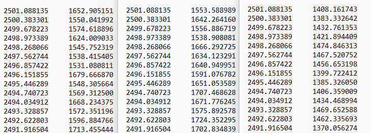
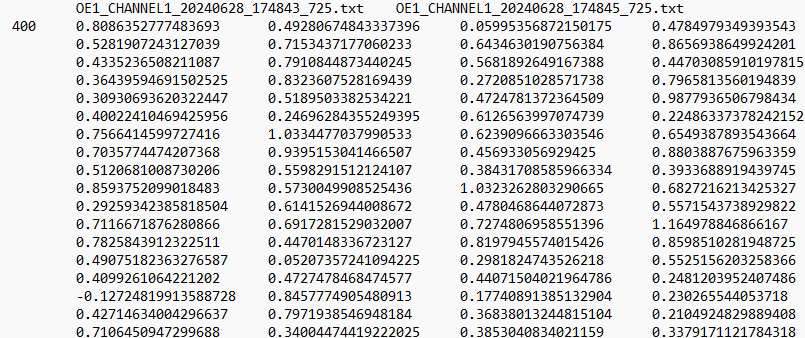
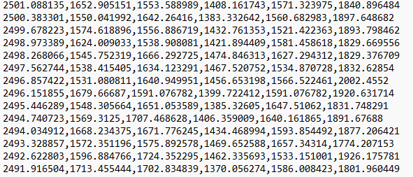

# Data Upload
{: .no_toc }

## Table of contents
{: .no_toc .text-delta }

1. TOC
{:toc}

---

## Video Demonstration

To learn more about how to upload your data, please watch our [YouTube Video](https://www.youtube.com/watch?v=ABpBwUnmEWw) about the data upload page.

## Supported formats

SpectraGuru currently supports the following data formats. 

- Multi files: .txt files (two-column single spectrum files. common x)
- Multi files: .csv files (two-column single spectrum files. common x)
- Single file: .csv file (A tab-separated csv (tsv)file)
- Single file: .csv file (A comma-separated csv (csv)file)

*More formats will be supported in the future*

**A successful upload should trigger Preview after the data upload container.**

### Multi files: .txt files (two-column single spectrum files. common x)

Each file should contain only two columns. The first column should not be the index. It should follow [x y] format. Both columns should be all numerical numbers with the same length. In each batch, all the txt files should have the same number of rows and the same length (x must be the same in each txt file). The second column usually indicates intensity. You could include headers, but it works best with no headers.

NaN and other abnormal values may raise errors and prevent you from moving forward.

**Example**

### Multi files: .csv files (two-column single spectrum files. common x)

Similar to the format above, but everything is in CSV format. You could include headers, but work the best with no headers.

NaN and other abnormal values may raise errors and prevent you from moving forward.

### Single file: .csv file (A tab-separated csv (tsv)file)

A tsv (Tab-Separated Values) file is a simple text format used to store data in a tabular structure, similar to a spreadsheet or database table. In a TSV file, each row of the table corresponds to a line in the text file, and each field within a row is separated by a tab character.

The Single file: .csv file (A tab-separated csv (tsv)file) upload option supports a tsv file with multiple spectra in one single file. The first column represents x-values, while the second column and after typically corresponds to y-values, such as intensity measurements ([x y y y y]format).

NaN and other abnormal values may raise errors and prevent you from moving forward.

**Example**

A tsv file may look like the following in a Notepad with word wrap:

### Single file: .csv file (A comma-separated csv (csv)file)

A CSV (Comma-Separated Values) file is a widely-used text format for storing tabular data, where each line in the file corresponds to a row in the table, and fields within a row are separated by commas.

Similar to Single file: .csv file (A tab-separated csv (tsv)file), Single file: .csv file (A comma-separated csv (csv)file) is expecting [x y y y y] format.

{: .important }
Dataframe exported from Spectraguru's processing page is a Single file: .csv file (A comma-separated csv (csv)file) file.

**Example**

A tsv file may look like the following in a Notepad:

**Need to work on a format that we are not supporting? Please send us an [email](zhao-nano-lab@uga.edu) and see if we can work something out!**

## After upload

After a successful upload, user have two options redirect to Processing Page by,

1. Click on Processing page button on main page
2. Click on Processing page from sidebar

A failure upload will be result in error messages in Processing and Analytics Page. The error messages will ask you go back to data upload to upload data. You would not see any follow up functions with a failure upload.  