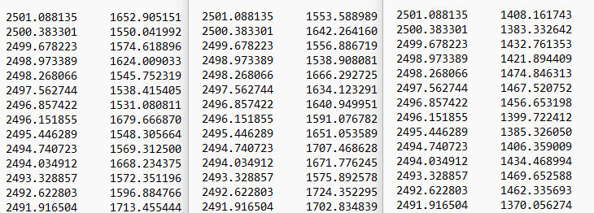
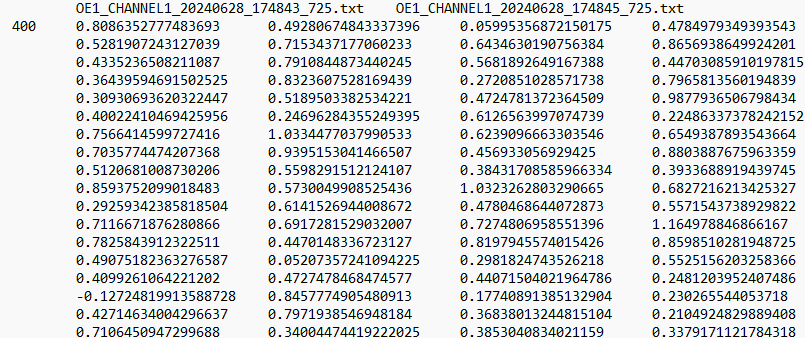
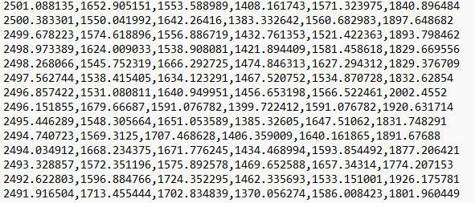

# Data Upload
{: .no_toc }

## Table of contents
{: .no_toc .text-delta }

1. TOC
{:toc}

---

## Introduction

Data Upload is the starting point for SpectraGuru workflows. It lets users load spectra manually from local files, query spectra from the SpectraGuru database when logged in, organize data into one or more classes, assign labels for machine learning, preview the loaded data, and continue to Processing.

{: .important }
SpectraGuru does not collect or store data through the manual Data Upload feature. Files uploaded from your computer are used only for the current analysis session. If you want to share your data with the rest of the SpectraGuru community through the database, please contact us.

For a walkthrough, watch the [Data Upload video demonstration](https://www.youtube.com/watch?v=ABpBwUnmEWw).

## Manual upload supported formats

Manual Upload is available inside each **Class** expander after selecting **Manual Upload** as the **Data Source**. SpectraGuru currently supports these upload formats:

| Format option | Expected file structure | Notes |
| --- | --- | --- |
| Multi TXT (two-column, common x) | Multiple `.txt` files, each with x and y columns | All files must share the same x-axis values. |
| Multi CSV (two-column, common x) | Multiple `.csv` files, each with x and y columns | All files must share the same x-axis values. |
| Single TSV (.tsv / tab-separated) | One tab-separated file with x in the first column and spectra in later columns | The app reads this option as a tab-separated CSV-style file. |
| Single CSV (comma-separated) | One comma-separated file with x in the first column and spectra in later columns | CSV files exported from SpectraGuru Processing can be loaded with this option. |

The first column should contain Raman shift values, and later columns should contain intensity values. Numeric data are required. Missing values, nonnumeric values, mismatched x-axis values in multi-file uploads, or a selected format that does not match the file contents can prevent the data from loading.

If you do not have data available, single-class upload mode also offers **Load sample data**.

### Multi-file TXT or CSV

Each file should contain at least two columns. The first column is the x-axis, usually Raman shift, and the second column is the intensity for one spectrum. In a multi-file batch, all files must have the same first-column values.

**Example**

### Single-file TSV

A tab-separated file should place Raman shift values in the first column and one or more spectra in the following columns.

**Example**

### Single-file CSV

A comma-separated file should use the same structure as the TSV option: Raman shift values in the first column and one or more spectra in the following columns.

**Example**

Need a format that is not supported? Please contact us and we can discuss whether it can be supported.

## Database search query

Database Query is available inside each **Class** expander after selecting **Database Query** as the **Data Source**. This feature is only available after the user logs in from the Welcome page. Guests can still use **Manual Upload**.

If the user is logged in and the database connection is available, SpectraGuru searches database batches by keyword. With **Advanced Search**, users can choose the data type filter:

- **Both**
- **Raw Data Only**
- **Standard Data Only**

After entering a search keyword, matching batches are shown in an editable results table. Users select one or more batches with the **Select** checkbox. The table includes metadata such as batch ID, analyte name, data type, spectrum count, concentration, and concentration units when available.

After selecting batches, click **Get Data**. SpectraGuru fetches spectra from the raw or standard database tables depending on the selected batch type. When multiple batches or classes are selected, spectra are interpolated to a common 1 cm^-1 Raman-shift grid and cropped to the shared overlapping Raman-shift range. This ensures every selected spectrum has the same x-axis values before Processing and Analytics.

SpectraGuru tracks the total number of selected spectra across all classes. Above 500 spectra, the app warns that processing may be slow. Above 1000 spectra, the app asks the user to reduce the selection before continuing.

## Label setup for machine learning

SpectraGuru stores labels during upload so Analytics machine learning tools can color or classify spectra.

1. Set **Number of classes** before loading data. Use `1` for a single unlabeled batch, or set two or more classes when you plan to compare labeled groups.
2. For each **Class** expander, optionally edit **Class label**. This label is used in generated spectrum names and in the default label table.
3. Choose **Manual Upload** or **Database Query** for each class, then load or query the class data.
4. When more than one class is loaded, SpectraGuru automatically interpolates all classes onto a shared Raman shift grid and crops them to the shared overlap range.
5. After all selected classes are ready, review the label editor. It contains one row per spectrum with **Spectrum** and **Label** columns.
6. Edit the **Label** column if needed. The edited table is stored as `label_df` and is used by PCA coloring and by Random Forest, KNN, and SVM classification.

Classification requires labels for every selected spectrum and at least two unique label values. If labels are missing, Analytics displays an error and asks you to upload or assign labels before running classification.

## After upload

After data are loaded successfully, SpectraGuru stores the loaded table as the active dataset and shows a **Preview**. The page also provides a **Processing Page** button so users can continue to preprocessing.

If upload or query fails, Processing and Analytics will not have usable data. Return to Data Upload, correct the selected format, login state, search query, or selected batches, and load the data again.
